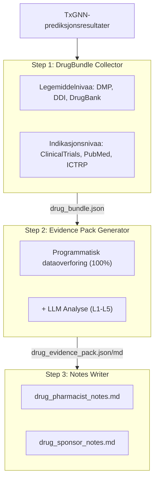
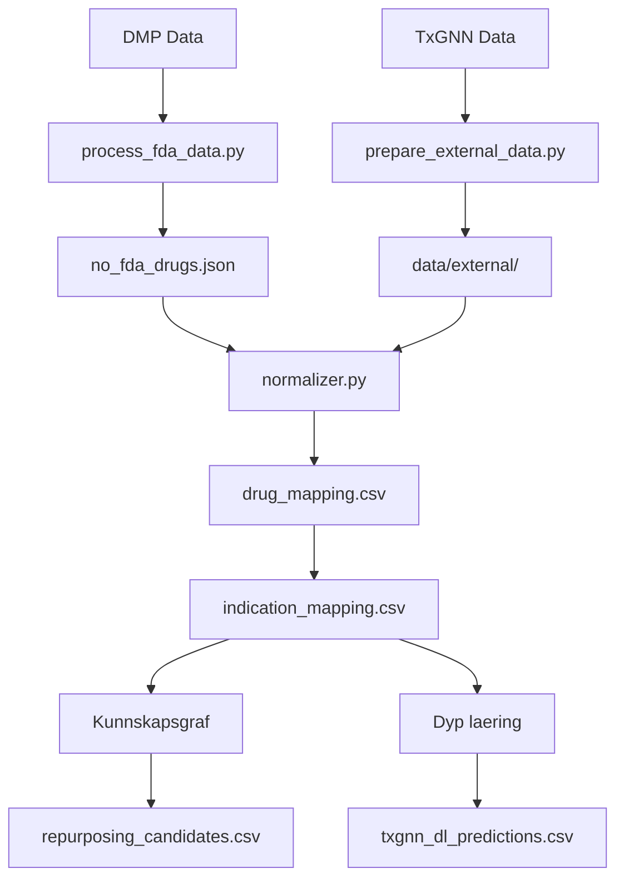

# NOTxGNN - Norge: Legemiddelreposisjonering

[](https://notxgnn.yao.care)
[](https://opensource.org/licenses/MIT)

Prediksjoner for legemiddelreposisjonering av DMP-godkjente legemidler (Norway) ved bruk av TxGNN-modellen.

## Ansvarsfraskrivelse

- Resultatene av dette prosjektet er kun for forskningsformaal og utgjor ikke medisinsk raadgivning.
- Kandidater for legemiddelreposisjonering krever klinisk validering for bruk.

## Prosjektoversikt

### Rapportstatistikk

| Element | Antall |
|------|------|
| **Legemiddelrapporter** | 466 |
| **Totale prediksjoner** | 2,539,217 |
| **Unike legemidler** | 641 |
| **Unike indikasjoner** | 17,041 |
| **DDI-data** | 302,516 |
| **DFI-data** | 857 |
| **DHI-data** | 35 |
| **DDSI-data** | 8,359 |
| **FHIR-ressurser** | 466 MK / 2,395 CUD |

### Fordeling av evidensnivaaer

| Evidensnivaa | Antall rapporter | Beskrivelse |
|---------|-------|------|
| **L1** | 0 | Flere Fase 3 RCT-er |
| **L2** | 0 | Enkelt RCT eller flere Fase 2 |
| **L3** | 0 | Observasjonelle studier |
| **L4** | 0 | Prekliniske / mekanistiske studier |
| **L5** | 466 | Kun beregningsbasert prediksjon |

### Etter kilde

| Kilde | Prediksjoner |
|------|------|
| DL | 2,536,822 |
| KG + DL | 2,149 |
| KG | 246 |

### Etter tillit

| Tillit | Prediksjoner |
|------|------|
| very_high | 1,688 |
| high | 117,105 |
| medium | 231,216 |
| low | 2,189,208 |

---

## Prediksjonsmetoder

| Metode | Hastighet | Noyaktighet | Krav |
|------|------|--------|----------|
| Kunnskapsgraf | Rask (sekunder) | Lavere | Ingen spesielle krav |
| Dyp laering | Langsom (timer) | Hoyere | Conda + PyTorch + DGL |

### Kunnskapsgraf-metode

```bash
uv run python scripts/run_kg_prediction.py
```

| Metrikk | Verdi |
|------|------|
| DMP Totalt antall legemidler | 1,850 |
| Kartlagt til DrugBank | 1,334 (72.1%) |
| Repositioneringskandidater | 2,395 |

### Dyp laering-metode

```bash
conda activate txgnn
PYTHONPATH=src python -m notxgnn.predict.txgnn_model
```

| Metrikk | Verdi |
|------|------|
| Totale DL-prediksjoner | 1,472,850 |
| Unike legemidler | 641 |
| Unike indikasjoner | 17,041 |

### Scoretolkning

TxGNN-scoren representerer modellens tillit til et legemiddel-sykdomspar, med et intervall fra 0 til 1.

| Terskelverdi | Betydning |
|-----|------|
| >= 0.9 | Svart hoy tillit |
| >= 0.7 | Hoy tillit |
| >= 0.5 | Moderat tillit |

#### Poengfordeling

| Terskelverdi | Betydning |
|-----|------|
| ≥ 0.9999 | Ekstremt hoey tillit, modellens mest sikre prediksjoner |
| ≥ 0.99 | Svart hoey tillit, verdt aa prioritere for validering |
| ≥ 0.9 | Hoey tillit |
| ≥ 0.5 | Moderat tillit (sigmoid-beslutningsgrense) |

#### Definisjoner av evidensnivaaer

| Nivaa | Definisjon | Klinisk betydning |
|-----|------|---------|
| L1 | Fase 3 RCT eller systematisk gjennomgang | Kan stoette klinisk bruk |
| L2 | Fase 2 RCT | Kan vurderes for bruk |
| L3 | Fase 1 eller observasjonsstudie | Krever videre evaluering |
| L4 | Kasusrapport eller preklinisk forskning | Ennaa ikke anbefalt |
| L5 | Kun beregningsbasert prediksjon, ingen klinisk evidens | Krever videre forskning |

#### Viktige paaminnelser

1. **Hoeye poeng garanterer ikke klinisk effektivitet: TxGNN-poeng er kunnskapsgrafbaserte prediksjoner som krever klinisk validering.**
2. **Lave poeng betyr ikke ineffektivt: modellen har kanskje ikke laert visse assosiasjoner.**
3. **Anbefales aa bruke med valideringspipeline: bruk dette prosjektets verktoey for aa gjennomgaa kliniske studier, litteratur og annen evidens.**

### Valideringspipeline



---

## Hurtigstart

### Trinn 1: Last ned data

| Fil | Nedlasting |
|------|------|
| DMP Data | [EMA Medicines Data (proxy for Norwegian-authorized medicines)](https://www.ema.europa.eu/en/medicines/download-medicine-data) |
| node.csv | [Harvard Dataverse](https://dataverse.harvard.edu/api/access/datafile/7144482) |
| kg.csv | [Harvard Dataverse](https://dataverse.harvard.edu/api/access/datafile/7144484) |
| edges.csv | [Harvard Dataverse](https://dataverse.harvard.edu/api/access/datafile/7144483) |
| model_ckpt.zip | [Google Drive](https://drive.google.com/uc?id=1fxTFkjo2jvmz9k6vesDbCeucQjGRojLj) |

### Trinn 2: Installer avhengigheter

```bash
uv sync
```

### Trinn 3: Behandle legemiddeldata

```bash
uv run python scripts/process_fda_data.py
```

### Trinn 4: Forbered vokabulardata

```bash
uv run python scripts/prepare_external_data.py
```

### Trinn 5: Kjoer kunnskapsgraf-prediksjon

```bash
uv run python scripts/run_kg_prediction.py
```

### Trinn 6: Sett opp dyp laering-miljoe

```bash
conda create -n txgnn python=3.11 -y
conda activate txgnn
pip install torch==2.2.2 torchvision==0.17.2
pip install dgl==1.1.3
pip install git+https://github.com/mims-harvard/TxGNN.git
pip install pandas tqdm pyyaml pydantic ogb
```

### Trinn 7: Kjoer dyp laering-prediksjon

```bash
conda activate txgnn
PYTHONPATH=src python -m notxgnn.predict.txgnn_model
```

---

## Ressurser

### TxGNN Kjerne

- [TxGNN Paper](https://www.nature.com/articles/s41591-024-03233-x) - Nature Medicine, 2024
- [TxGNN GitHub](https://github.com/mims-harvard/TxGNN)
- [TxGNN Explorer](http://txgnn.org)

### Datakilder

| Kategori | Data | Kilde | Merknad |
|------|------|------|------|
| **Legemiddeldata** | DMP | [EMA Medicines Data (proxy for Norwegian-authorized medicines)](https://www.ema.europa.eu/en/medicines/download-medicine-data) | Norway |
| **Kunnskapsgraf** | TxGNN KG | [Harvard Dataverse](https://dataverse.harvard.edu/dataset.xhtml?persistentId=doi:10.7910/DVN/IXA7BM) | 17,080 diseases, 7,957 drugs |
| **Legemiddeldatabase** | DrugBank | [DrugBank](https://go.drugbank.com/) | Kartlegging av legemiddelingredienser |
| **Legemiddelinteraksjoner** | DDInter 2.0 | [DDInter](https://ddinter2.scbdd.com/) | DDI-par |
| **Legemiddelinteraksjoner** | Guide to PHARMACOLOGY | [IUPHAR/BPS](https://www.guidetopharmacology.org/) | Godkjente legemiddelinteraksjoner |
| **Kliniske studier** | ClinicalTrials.gov | [CT.gov API v2](https://clinicaltrials.gov/data-api/api) | Register for kliniske studier |
| **Kliniske studier** | WHO ICTRP | [ICTRP API](https://apps.who.int/trialsearch/api/v1/search) | Internasjonal plattform for kliniske studier |
| **Litteratur** | PubMed | [NCBI E-utilities](https://eutils.ncbi.nlm.nih.gov/entrez/eutils/) | Medisinsk litteratursok |
| **Navnekartlegging** | RxNorm | [RxNav API](https://rxnav.nlm.nih.gov/REST) | Standardisering av legemiddelnavn |
| **Navnekartlegging** | PubChem | [PUG-REST API](https://pubchem.ncbi.nlm.nih.gov/docs/pug-rest) | Kjemiske stoff-synonymer |
| **Navnekartlegging** | ChEMBL | [ChEMBL API](https://www.ebi.ac.uk/chembl/api/data) | Bioaktivitetsdatabase |
| **Standarder** | FHIR R4 | [HL7 FHIR](http://hl7.org/fhir/) | MedicationKnowledge, ClinicalUseDefinition |
| **Standarder** | SMART on FHIR | [SMART Health IT](https://smarthealthit.org/) | EHR-integrasjon, OAuth 2.0 + PKCE |

### Modellnedlastinger

| Fil | Nedlasting | Merknad |
|------|------|------|
| Fortrent modell | [Google Drive](https://drive.google.com/uc?id=1fxTFkjo2jvmz9k6vesDbCeucQjGRojLj) | model_ckpt.zip |
| node.csv | [Harvard Dataverse](https://dataverse.harvard.edu/api/access/datafile/7144482) | Nodedata |
| kg.csv | [Harvard Dataverse](https://dataverse.harvard.edu/api/access/datafile/7144484) | Kunnskapsgrafdata |
| edges.csv | [Harvard Dataverse](https://dataverse.harvard.edu/api/access/datafile/7144483) | Kantdata (DL) |

## Prosjektintroduksjon

### Katalogstruktur

```
NOTxGNN/
├── README.md
├── CLAUDE.md
├── pyproject.toml
│
├── config/
│   └── fields.yaml
│
├── data/
│   ├── kg.csv
│   ├── node.csv
│   ├── edges.csv
│   ├── raw/
│   ├── external/
│   ├── processed/
│   │   ├── drug_mapping.csv
│   │   ├── repurposing_candidates.csv
│   │   ├── txgnn_dl_predictions.csv.gz
│   │   └── integration_stats.json
│   ├── bundles/
│   └── collected/
│
├── src/notxgnn/
│   ├── data/
│   │   └── loader.py
│   ├── mapping/
│   │   ├── normalizer.py
│   │   ├── drugbank_mapper.py
│   │   └── disease_mapper.py
│   ├── predict/
│   │   ├── repurposing.py
│   │   └── txgnn_model.py
│   ├── collectors/
│   └── paths.py
│
├── scripts/
│   ├── process_fda_data.py
│   ├── prepare_external_data.py
│   ├── run_kg_prediction.py
│   └── integrate_predictions.py
│
├── docs/
│   ├── _drugs/
│   ├── fhir/
│   │   ├── MedicationKnowledge/
│   │   └── ClinicalUseDefinition/
│   └── smart/
│
├── model_ckpt/
└── tests/
```

**Forklaring**: 🔵 Prosjektutvikling | 🟢 Lokale data | 🟡 TxGNN-data | 🟠 Valideringspipeline

### Dataflyt



---

## Sitering

Hvis du bruker dette datasettet eller programvaren, vennligst siter:

```bibtex
@software{notxgnn2026,
  author       = {Yao.Care},
  title        = {NOTxGNN: Drug Repurposing Validation Reports for Norway DMP Drugs},
  year         = 2026,
  publisher    = {GitHub},
  url          = {https://github.com/yao-care/NOTxGNN}
}
```

Siter ogsaa den originale TxGNN-artikkelen:

```bibtex
@article{huang2023txgnn,
  title={A foundation model for clinician-centered drug repurposing},
  author={Huang, Kexin and Chandak, Payal and Wang, Qianwen and Haber, Shreyas and Zitnik, Marinka},
  journal={Nature Medicine},
  year={2023},
  doi={10.1038/s41591-023-02233-x}
}
```
